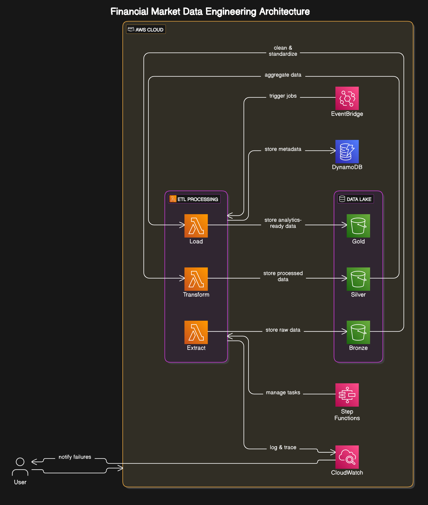

# Engenharia de Dados para Mercado Financeiro

Uma solução completa de engenharia de dados para análise de mercado financeiro, construída com princípios de arquitetura limpa e infraestrutura AWS.



## Visão Geral do Projeto

Este projeto implementa um pipeline completo de engenharia de dados para mercado financeiro, incluindo:

- **Extração** de dados de múltiplas fontes (Yahoo Finance, Alpha Vantage)
- **Transformação** e processamento de dados (indicadores técnicos, análises)
- **Armazenamento** em arquitetura Lakehouse (camadas Bronze, Silver e Gold)
- **Observabilidade** e monitoramento
- **Segurança** e mascaramento de dados

A arquitetura segue os princípios da **Arquitetura Limpa (Clean Architecture)** com clara separação de preocupações e regras de dependência, tornando o sistema flexível, testável e de fácil manutenção.

## Arquitetura do Projeto

### Arquitetura de Software (Clean Architecture)

O projeto está organizado em camadas de acordo com a Arquitetura Limpa:

1. **Camada de Domínio**: Contém regras de negócio e entidades que são independentes de sistemas externos
   - `src/domain/entities/`: Entidades de negócio principais (Stock, StockPrice, etc.)
   - `src/domain/interfaces/`: Interfaces abstratas para repositórios e serviços
   - `src/domain/value_objects/`: Objetos de valor usados no domínio

2. **Camada de Aplicação**: Contém casos de uso específicos da aplicação
   - `src/application/use_cases/`: Casos de uso de negócio (Extract, Transform, Load, Bronze, Silver, Gold)

3. **Camada de Infraestrutura**: Contém adaptadores para frameworks externos e ferramentas
   - `src/infrastructure/adapters/`: Adaptadores para serviços externos (Yahoo Finance, Alpha Vantage)
   - `src/infrastructure/repositories/`: Implementações de repositórios (S3, DynamoDB)
   - `src/infrastructure/services/`: Implementação de serviços
   - `src/infrastructure/config/`: Configuração e ajustes

4. **Camada de Interfaces**: Contém componentes que interagem com sistemas externos
   - `src/interfaces/api/`: API Web e rotas
   - `src/interfaces/factories/`: Classes de fábrica para criação de instâncias
   - `src/interfaces/jobs/`: Trabalhos agendados

### Arquitetura de Dados (Lakehouse)

O projeto implementa uma arquitetura Lakehouse moderna com três camadas:

1. **Camada Bronze (Raw)**
   - Dados brutos extraídos das fontes sem modificação
   - Preserva dado original para auditoria e reprocessamento
   - Formato: Parquet particionado por data

2. **Camada Silver (Processed)**
   - Dados limpos, validados e enriquecidos
   - Indicadores técnicos calculados
   - Formato: Parquet otimizado para processamento

3. **Camada Gold (Analytics)**
   - Dados agregados e prontos para consumo
   - Métricas de negócio, estatísticas e KPIs
   - Formato: Parquet/JSON otimizado para consulta

### Infraestrutura AWS

- **Amazon S3**: Data Lake principal para armazenar dados em todas as camadas
- **Amazon DynamoDB**: Metadados e acesso rápido
- **AWS Lambda**: Processamento em tempo real e extração agendada
- **Amazon CloudWatch**: Monitoramento, logging e observabilidade
- **AWS CDK**: Infraestrutura como código

## Começando

### Pré-requisitos

- Python 3.11+
- Conta AWS e credenciais configuradas
- Java 8+ (para Apache Spark)
- Node.js 14+ (para AWS CDK)

### Configuração Rápida

1. Clone o repositório
   ```bash
   git clone https://github.com/seu-usuario/financial-market-data.git
   cd financial-market-data
   ```

2. Crie e ative um ambiente virtual
   ```bash
   python -m venv venv
   source venv/bin/activate  # No Windows: venv\Scripts\activate
   ```

3. Instale as dependências
   ```bash
   pip install -r requirements.txt
   ```

4. Configure as variáveis de ambiente
   ```bash
   cp .env.example .env
   # Edite o arquivo .env com suas configurações
   ```

Para instruções detalhadas de configuração, consulte [docs/SETUP.md](docs/SETUP.md).

### Executando o Pipeline Completo

Execute o pipeline completo (Bronze, Silver e Gold):

```bash
python tests/e2e/pipeline/test_full_pipeline.py --ticker AAPL --days 30
```

Opções:
- `--ticker`: Símbolo da ação (padrão: AAPL)
- `--days`: Número de dias de dados históricos (padrão: 30)
- `--tickers`: Lista de múltiplos tickers separados por vírgula (ex: AAPL,MSFT,GOOG)
- `--use-spark`: Usar Spark para processamento (padrão: Pandas)
- `--steps`: Etapas a serem executadas (all, bronze, silver, gold, bronze-silver, silver-gold)
- `--verbose`: Ativar logging detalhado

Para mais detalhes sobre o pipeline, consulte [docs/PIPELINE.md](docs/PIPELINE.md).

### Implantação na AWS

Para implantar a infraestrutura na AWS:

```bash
cd infrastructure/cdk
npm install
npx cdk deploy --context environment=dev
```

Para instruções detalhadas de implantação, consulte [docs/AWS_DEPLOYMENT.md](docs/AWS_DEPLOYMENT.md).

## Exemplos de Uso

### Camada Bronze (Dados Brutos)

Carregar dados de ações na camada Bronze:

```python
from src.application.use_cases.bronze_layer import LoadToBronzeLayerUseCase
import yfinance as yf
import pandas as pd
from datetime import datetime, timedelta

# Configurar o caso de uso
bronze_use_case = LoadToBronzeLayerUseCase(
    bucket_name="seu-bucket-s3",
    observability_service=observability_service
)

# Extrair dados do Yahoo Finance
end_date = datetime.now()
start_date = end_date - timedelta(days=30)
ticker = "AAPL"
stock = yf.Ticker(ticker)
df = stock.history(start=start_date, end=end_date)
df = df.reset_index()

# Carregar na camada Bronze
bronze_key = bronze_use_case.load_stock_data(
    ticker=ticker,
    data_df=df,
    data_type="prices",
    timestamp=datetime.now()
)
print(f"Dados salvos em: {bronze_key}")
```

### Camada Silver (Dados Processados)

Processar dados da camada Bronze para Silver:

```python
from src.application.use_cases.silver_layer import ProcessToSilverLayerUseCase

# Configurar o caso de uso
silver_use_case = ProcessToSilverLayerUseCase(
    bucket_name="seu-bucket-s3",
    data_processing_service=data_processing_service,
    observability_service=observability_service
)

# Processar dados
silver_key = silver_use_case.process_stock_data(
    ticker="AAPL",
    bronze_key="bronze/stocks/AAPL/prices/year=2023/month=12/day=01/AAPL_20231201_120000.parquet"
)
print(f"Dados processados salvos em: {silver_key}")
```

### Camada Gold (Dados Analíticos)

Agregar dados da camada Silver para Gold:

```python
from src.application.use_cases.gold_layer import AggregateToGoldLayerUseCase

# Configurar o caso de uso
gold_use_case = AggregateToGoldLayerUseCase(
    bucket_name="seu-bucket-s3",
    observability_service=observability_service
)

# Agregar dados
silver_keys = [
    "silver/stocks/AAPL/prices/year=2023/month=12/AAPL_processed_20231201.parquet"
]
gold_keys = gold_use_case.aggregate_stock_data(
    ticker="AAPL",
    silver_keys=silver_keys
)
print(f"Dados agregados salvos em: {gold_keys}")
```

## Componentes Principais

### Casos de Uso

- **ExtractStockDataUseCase**: Extrai dados históricos de ações
- **TransformStockDataUseCase**: Calcula indicadores técnicos
- **LoadStockDataUseCase**: Armazena dados processados
- **LoadToBronzeLayerUseCase**: Carrega dados na camada Bronze
- **ProcessToSilverLayerUseCase**: Processa dados para camada Silver
- **AggregateToGoldLayerUseCase**: Agrega dados para camada Gold

### Serviços

- **YahooFinanceAdapter**: Interface com Yahoo Finance API
- **AlphaVantageAdapter**: Interface com Alpha Vantage API
- **PandasDataProcessingService**: Processamento com Pandas
- **SparkDataProcessingService**: Processamento distribuído com Spark
- **AWSObservabilityService**: Monitoramento e observabilidade
- **SimpleDataMaskingService**: Mascaramento de dados sensíveis

### Repositórios

- **S3StockRepository**: Armazenamento de dados em S3
- **DynamoDBStockRepository**: Armazenamento em DynamoDB
- **S3MarketDataRepository**: Armazenamento de dados de mercado

## Documentação Adicional

- [Instruções de Configuração](docs/SETUP.md)
- [Descrição do Pipeline de Dados](docs/PIPELINE.md)
- [Guia de Implantação AWS](docs/AWS_DEPLOYMENT.md)
- [Arquitetura Detalhada](docs/architecture.md)

## Licença

Este projeto está licenciado sob a Licença MIT - consulte o arquivo LICENSE para mais detalhes.