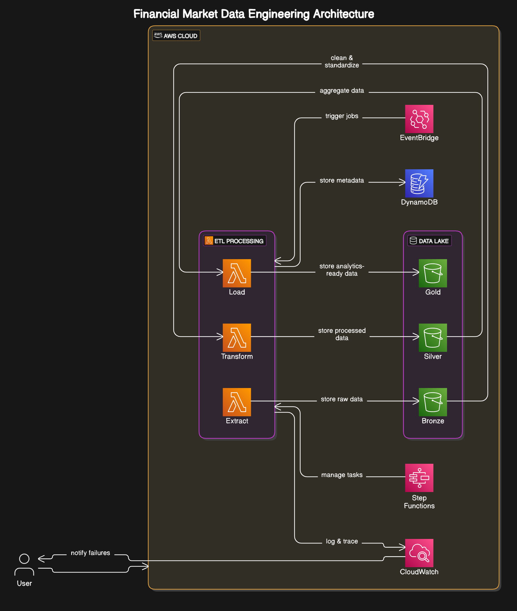

# Pipeline de Dados - Documentação

Este documento descreve o pipeline de dados implementado no projeto de Engenharia de Dados para Mercado Financeiro, sua arquitetura, componentes e fluxo de processamento.

## Visão Geral da Arquitetura

O projeto implementa uma arquitetura moderna de Lakehouse, combinando os benefícios de Data Lake e Data Warehouse, com três camadas principais:



## Camadas do Lakehouse

### 1. Camada Bronze (Raw Data)

- **Propósito**: Armazenar dados brutos sem modificação
- **Características**:
  - Dados em seu formato original ou levemente estruturados
  - Sem limpeza ou validação
  - Completo e imutável para reprocessamento ou auditoria
- **Formato**: Parquet particionado por data
- **Padrão de Caminho**: `bronze/stocks/{ticker}/{data_type}/year={year}/month={month}/day={day}/`
- **Caso de Uso**: `LoadToBronzeLayerUseCase`

### 2. Camada Silver (Processed Data)

- **Propósito**: Dados limpos, validados e enriquecidos
- **Características**:
  - Esquema consistente e padronizado
  - Problemas de qualidade corrigidos (valores nulos, duplicatas)
  - Enriquecido com indicadores técnicos e métricas calculadas
  - Otimizado para processamento
- **Formato**: Parquet particionado
- **Padrão de Caminho**: `silver/stocks/{ticker}/{data_type}/year={year}/month={month}/`
- **Caso de Uso**: `ProcessToSilverLayerUseCase`

### 3. Camada Gold (Analytics Data)

- **Propósito**: Agregações de negócio prontas para consumo
- **Características**:
  - Dados agregados e modelados por dimensão
  - Otimizados para consulta e visualização
  - Visões de negócio (dados mensais, estatísticas)
  - Menor volume, maior valor analítico
- **Formato**: Parquet/JSON
- **Padrão de Caminho**: `gold/stocks/{ticker}/{data_type}/`
- **Caso de Uso**: `AggregateToGoldLayerUseCase`

## Fluxo de Dados

O pipeline de dados segue o fluxo:

1. **Extração** - Dados são extraídos de fontes externas como Yahoo Finance ou Alpha Vantage
2. **Bronze** - Dados brutos são armazenados imutáveis no S3
3. **Silver** - Dados são limpos, padronizados e enriquecidos com indicadores técnicos
4. **Gold** - Dados são agregados em visões analíticas prontas para consumo


## Componentes Principais

### Casos de Uso

Os casos de uso principais que compõem o pipeline são:

#### ETL Tradicional

- **ExtractStockDataUseCase**: Extrai dados históricos de ações de fontes externas
- **TransformStockDataUseCase**: Calcula indicadores técnicos e métricas
- **LoadStockDataUseCase**: Armazena dados processados

#### Lakehouse

- **LoadToBronzeLayerUseCase**: Carrega dados brutos na camada Bronze
- **ProcessToSilverLayerUseCase**: Processa dados da Bronze para Silver
- **AggregateToGoldLayerUseCase**: Agrega dados da Silver para Gold

#### Processamento em Lote

- **BatchProcessStocksUseCase**: Processa múltiplos tickers em paralelo

### Serviços e Adaptadores

- **YahooFinanceAdapter**: Extrai dados da API do Yahoo Finance
- **AlphaVantageAdapter**: Extrai dados da API Alpha Vantage
- **PandasDataProcessingService**: Processamento de dados usando Pandas
- **SparkDataProcessingService**: Processamento distribuído usando Apache Spark
- **AWSObservabilityService**: Serviço de observabilidade usando CloudWatch
- **SimpleDataMaskingService**: Mascara dados sensíveis para conformidade

### Repositórios

- **S3StockRepository**: Persistência de dados de ações no S3
- **S3MarketDataRepository**: Persistência de dados de mercado no S3
- **DynamoDBStockRepository**: Persistência de dados de ações no DynamoDB

## Tecnologias de Processamento

O projeto suporta duas tecnologias principais para processamento de dados:

### Pandas

- **Casos de uso**: Volumes menores, desenvolvimento e prototipagem
- **Implementação**: `PandasDataProcessingService`
- **Vantagens**: Simplicidade, facilidade de uso, sem dependências externas
- **Limitações**: Processamento em memória, limitado ao poder computacional de uma máquina

### Apache Spark

- **Casos de uso**: Grandes volumes de dados, processamento distribuído
- **Implementação**: `SparkDataProcessingService`
- **Vantagens**: Escalabilidade horizontal, processamento distribuído
- **Limitações**: Maior complexidade, requisitos adicionais (Java, etc.)

O sistema automaticamente usa Pandas como fallback se o Spark falhar na inicialização.

## Indicadores Técnicos Calculados

O pipeline calcula automaticamente vários indicadores técnicos:

- **Médias Móveis**: SMA (5, 20, 50 dias), EMA (5, 20 dias)
- **RSI** (Relative Strength Index): Período de 14 dias
- **Bollinger Bands**: Período de 20 dias, 2 desvios padrão
- **MACD** (Moving Average Convergence Divergence): 12, 26, 9 dias
- **Volatilidade**: Diária e anualizada
- **Estatísticas de Retorno**: Retorno diário médio, desvio padrão
- **Níveis de Suporte e Resistência**: Baseados em pontos de pivô

## Processamento em Lote

Para processar múltiplos tickers em paralelo:

```bash
python scripts/batch_process.py --tickers "AAPL,MSFT,GOOG" --days 30 --parallel --max-workers 5
```

Este comando iniciará o processamento em paralelo para os três tickers especificados, usando no máximo 5 threads simultâneas.

## Observabilidade e Monitoramento

O pipeline inclui capacidades abrangentes de observabilidade:

- **Logs**: Logs estruturados para todas as operações
- **Métricas**: Tempo de processamento, número de registros, etc.
- **Rastreamento**: IDs de rastreamento para acompanhar o fluxo completo
- **Eventos**: Eventos específicos do pipeline para monitoramento

Os registros são encaminhados para o AWS CloudWatch para monitoramento centralizado.

## Integração com AWS Lambda

O pipeline pode ser executado em AWS Lambda para processamento automático:

- **lambda_handler**: Ponto de entrada para execução de trabalhos
- **Ações suportadas**:
  - `extract_daily_data`: Extrai dados diários de múltiplos tickers
  - `extract_historical_data`: Extrai dados históricos
  - `process_to_silver`: Processa dados da camada bronze para prata
  - `aggregate_to_gold`: Agrega dados da camada prata para ouro

## Extensibilidade

O pipeline foi projetado para ser extensível:

- **Novas fontes de dados**: Implemente a interface `FinancialDataService`
- **Novos métodos de processamento**: Implemente a interface `DataProcessingService`
- **Novos repositórios de dados**: Implemente as interfaces de repository
- **Novos indicadores técnicos**: Adicione ao serviço de processamento existente

## Considerações de Performance

- O processamento em batch é recomendado para mais de 10 tickers
- O Spark é recomendado para mais de 1 ano de dados históricos
- A particionamento de dados no S3 otimiza consultas por data
- O caching de dados (`DataCacheService`) reduz chamadas à API externas

## FAQs do Pipeline

**P: Como adicionar um novo indicador técnico?**
R: Adicione a implementação do cálculo no `PandasDataProcessingService` e/ou `SparkDataProcessingService`.

**P: Como processar novos tipos de dados além de preços?**
R: Crie um novo caso de uso ou estenda os existentes, mantendo a mesma estrutura de camadas.

**P: Quais são os limites de API para fontes externas?**
R: Yahoo Finance tem limites não documentados. Alpha Vantage permite 5 chamadas por minuto e 500 por dia no plano gratuito.